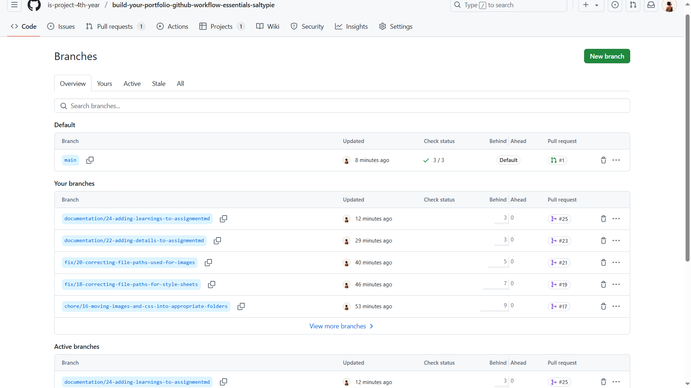
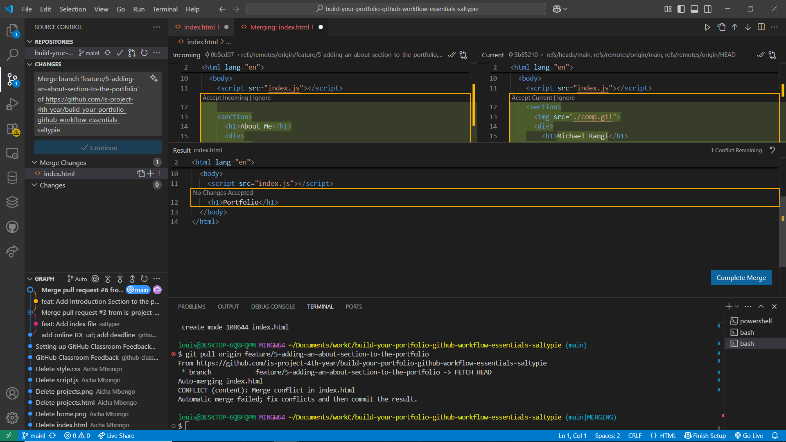

# Personal Portfolio Documentation

## 1. Student Details

- **Full Name**: Louis Michael Rangi Gacho
- **GitHub Username**: saltypie
- **Email**: louisrangi1@gmail.com

## 2. Deployed Portfolio Link

- **GitHub Pages URL**:  
  _(https://is-project-4th-year.github.io/build-your-portfolio-github-workflow-essentials-saltypie/)_

## 3. Learnings from the Git Crash Program

- **Resolving Merge Conflicts**: Helped me resolve challenges that I faced when modifying the same lines in the index.html file in different branches.

- **Branching**: Helped me make changes to different versions of the portfolio project without changing the main branch which would affect the live github pages site.

- **Issues & Projects**: Helped me with eparation of concerns using issues based on features, fixes or tasks to be performed. Helped me manage my workflow by using the project board. Helped me track what needs to be solved and what has already been solved.

- **Commit Management**: Helped me name the commit messages using conventions that made it easy to track and record the types of changes and reasons for changes. Helped me track past changes.

## 4. Screenshots of Key GitHub Features

Included below are screenshots that demonstrate how I used GitHub to manage the project. 

### A. Milestones and Issues

- 
- A screenshot of the first milestone.
- 
- The issues under milestone 1 "Create Portfolio Page".
- 
- Milestone 2.
### B. Project Board
- 
- The project board.

### C. Branching
- 
- The branch list for the repository showing the default branch and active branches.

### D. Pull Requests
- 
- 

- Screenshots of a pull request that has been merged and linked to a related issue (issue #16).

### E. Merge Conflict Resolution
- 
- 
- 

- Screenshots of a merge conflict, resolution using the merge editor on visual studio code and the final resolved merge. 
